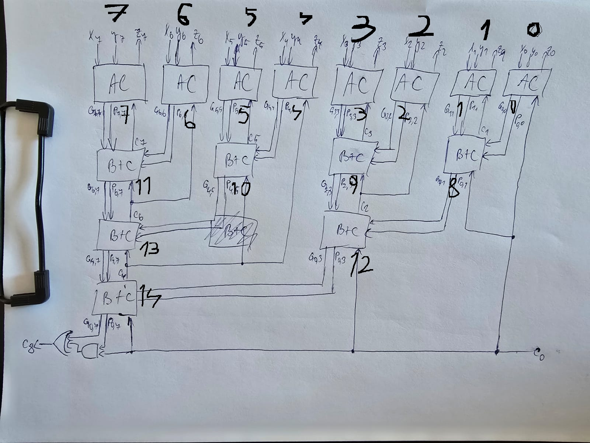

# ALU-8bit

An 8-bit Arithmetic Logic Unit implemented in Verilog.  
This project supports various arithmetic operations including **addition, subtraction, multiplication, and division**, designed using advanced architectures like **Carry Lookahead Adders (CLA)**, **Booth’s multiplier**, and **SRT division**.

---

## 🧠 Features

### ✔️ Supported Operations:
- ➕ **Addition**: Implemented using a **ML-CLA (Multi-Level Carry Lookahead Adder)**.
- ➖ **Subtraction**: Built using a **1-bit adder cell**.
- ✖️ **Multiplication**: Utilizes **Booth’s radix-4 algorithm**.
- ➗ **Division**: Uses **SRT radix-2 division algorithm**.
- 🔁 **Control Unit**: Handles operation selection via control signals.

---

## 📁 Project Structure

| File / Folder          | Description |
|------------------------|-------------|
| `alu.v`                | Top-level ALU module with operation control |
| `alu.v.bak`            | Backup of ALU with earlier implementation |
| `mlcla.v`              | Multi-level Carry Lookahead Adder module |
| `mlcla.v.bak`          | Backup of `mlcla.v` |
| `_9bitadder.v`         | 9-bit adder module used in CLA |
| `multiplier8bit.v`     | Trial Multiplier based on Booth’s algorithm |
| `multiplier8bit.bak`   | Backup version of trial Booth multiplier |
| `newbooth.v`           | Booth’s radix-4 implementation |
| `newbooth.v.bak`       | Earlier prototype of Booth module |
| `sr2.v`                | SRT division module |
| `sr2.v.bak`            | Backup of division unit |
| `cu.v`                 | Control unit for operation selection |
| `design.png`           | High-level architecture block diagram |
| `README.md`            | Project documentation |

---

## ⚙️ Operation Control

The ALU takes in an **opcode** to determine the operation:

| Opcode | Operation      |
|--------|----------------|
| 000    | Addition        |
| 001    | Subtraction     |
| 010    | Multiplication  |
| 011    | Division        |
| ...    | Extendable      |

The control unit (`cu.v`) decodes the opcode and routes signals to the proper module.
---
## ➕/➖ Addition/Subtraction
### ⚙️ Module Overview
The mlcla.v module implements an 8-bit adder/subtractor using a multi-level carry lookahead architecture, which is faster than ripple-carry by computing carry signals in parallel using hierarchical grouping.

| Signal     | Width | Direction | Description                           |
| ---------- | ----- | --------- | ------------------------------------- |
| `x`        | 8-bit | Input     | First operand                         |
| `y`        | 8-bit | Input     | Second operand                        |
| `select`   | 1-bit | Input     | `0` for addition, `1` for subtraction |
| `start`    | 1-bit | Input     | Enables computation of flags          |
| `z`        | 8-bit | Output    | Result of the operation               |
| `c8`       | 1-bit | Output    | Final carry-out                       |
| `overflow` | 1-bit | Output    | High if signed overflow occurs        |
| `negative` | 1-bit | Output    | High if result is negative (MSB is 1) |
| `zero`     | 1-bit | Output    | High if result is 0                   |

### 🧠 Architecture:

  -Bit-level modules (AC) compute generate/propagate/sum values per bit.

  -Group logic modules (BplusC) form hierarchical carry lookahead trees for speed.

-Subtraction is done using two’s complement logic: y ^ select, with initial carry-in as select.

### ⚠️ Flag Details:
| Flag       | Description                                                              |
| ---------- | ------------------------------------------------------------------------ |
| `overflow` | Set when signed overflow occurs (e.g., 127 + 1)                          |
| `zero`     | Set when all bits of result `z` are 0                                    |
| `negative` | Set if the most significant bit (MSB) of result `z[7]` is 1 (signed < 0) |

### 🖼️ MLCLA Architecture Diagram

---
## ✖️ Multiplication

### ⚙️ Module Overview
This design implements a Modified Booth Multiplier using a hierarchical adder architecture (_9bitadder) and basic modules (AC, BplusC) for efficient multi-level carry logic.
| Input          | Description             |
| -------------- | ----------------------- |
| `multiplicand` | 8-bit signed input      |
| `multiplier`   | 8-bit signed input      |
| `clk`, `rst`   | Clock and Reset signals |
| `start`        | Start computation       |

| Output | Description                |
| ------ | -------------------------- |
| `p`    | 16-bit signed product      |
| `done` | Done flag (high when done) |

Includes optimization for:

-Early exit when operands are 0 or 1

-2-bit arithmetic right shift per cycle (Radix-4)

              +----------------+
              |     IDLE      |
              |-------------- |
              | Wait for start|
              | Check for     |
              | zero/one case |
              +-------+-------+
                      |
               start & not trivial
                      v
              +----------------+
              |     LOAD      |
              |-------------- |
              | Decode Q[2:0] |
              | Setup Adder   |
              +-------+-------+
                      |
                      v
              +----------------+
              |   COMPUTE     |
              |-------------- |
              | Perform Add/Sub|
              | Update A       |
              +-------+-------+
                      |
            done?-----+-----No--------+
                      |               |
                     Yes              v
                      |        +---------------+
                      +------> |    FINISH     |
                               |---------------|
                               | Shift A & Q   |
                               +-------+-------+
                                       |
                                       v
                                     (back to LOAD)

---
## ➗ Division
### ⚙️ Module Overview
This design implements an SRT Radix-2 Divider using a hierarchical carry-lookahead adder (_9bitadder) and basic modules (AC, BplusC) for efficient arithmetic logic.

| Input        | Description                |
| ------------ | -------------------------- |
| `dividend`   | 8-bit unsigned numerator   |
| `divisor`    | 8-bit unsigned denominator |
| `clk`, `rst` | Clock and Reset signals    |
| `start`      | Start signal for division  |

| Output        | Description                          |
| ------------- | ------------------------------------ |
| `quotient`    | 8-bit unsigned quotient result       |
| `remainder`   | 8-bit unsigned remainder             |
| `done`        | High when division is complete       |
| `divisionBy0` | High if division by zero is detected |

              +----------------+
              |     IDLE      |
              |---------------|
              | Wait for      |
              | start signal  |
              +-------+-------+
                      |
                      v
              +----------------------+
              |  SHIFT_NORMALIZE    |
              |----------------------|
              | Align divisor        |
              | by left-shifting     |
              +-------+--------------+
                      |
                      v
              +----------------------+
              |    DIVIDE_LOOP      |
              |----------------------|
              | Subtract/Add based   |
              | on MSBs of A         |
              | Update A, Q          |
              +-------+--------------+
                      |
               done? --+-- No --> (repeat)
                      |
                     Yes
                      v
              +----------------------+
              | FINAL_CORRECTION     |
              |----------------------|
              | If A is negative,    |
              | restore remainder    |
              +-------+--------------+
                      |
                      v
              +----------------------+
              |    SHIFT_BACK        |
              |----------------------|
              | Undo normalization   |
              | shift to restore     |
              +-------+--------------+
                      |
                      v
              +----------------------+
              |        DONE          |
              |----------------------|
              | Output quotient and  |
              | remainder            |
              +----------------------+
              -
---
## ➕➖✖️➗ Arithmetic Unit (AU)
### ⚙️ Module Overview
The au module integrates signed 8-bit arithmetic operations—addition, subtraction, multiplication (Booth), and division (SRT2)—into a unified unit, using hierarchical modules for efficient computation.

| Input             | Description                             |
| ----------------- | --------------------------------------- |
| `A`, `B`          | 8-bit signed inputs                     |
| `clk`, `rst`      | Clock and Reset signals                 |
| `startadd`        | Start signal for addition               |
| `startsub`        | Start signal for subtraction            |
| `startdiv`        | Start signal for division               |
| `startmultiplier` | Start signal for multiplication (Booth) |

| Output        | Description                                     |
| ------------- | ----------------------------------------------- |
| `result`      | 16-bit signed result (operation dependent)      |
| `done`        | Flag indicating completion of current operation |
| `overflow`    | Overflow flag (only for add/sub)                |
| `negative`    | Negative result flag (only for add/sub)         |
| `zero`        | Zero result flag (only for add/sub)             |
| `carry_out`   | Carry out flag (only for add/sub)               |
| `divisionBy0` | Division-by-zero flag                           |

### 🧠 Internal Behavior
Addition/Subtraction: Instant combinational execution using the mlcla (multi-level carry look-ahead adder).

Multiplication: Pipelined Booth's algorithm (newbooth) with Radix-4 optimization.

Division: Radix-2 SRT division via the srt2 module with quotient/remainder packing.
---
🧮 ALU (Arithmetic Logic Unit)
⚙️ Module Overview
The alu module integrates both control (cu) and arithmetic (au) units to perform a variety of 8-bit signed arithmetic operations: addition, subtraction, multiplication (Booth's algorithm), and division (SRT2), outputting a 16-bit result.
| Input    | Description                             |
| -------- | --------------------------------------- |
| `clk`    | Clock signal                            |
| `rst`    | Reset signal                            |
| `select` | 2-bit control signal (operation select) |
| `A`, `B` | 8-bit signed operands                   |

| Output        | Description                                       |
| ------------- | ------------------------------------------------- |
| `result`      | 16-bit signed result: operation-dependent         |
| `overflow`    | Overflow flag (only for addition and subtraction) |
| `negative`    | Indicates result is negative (only for add/sub)   |
| `zero`        | Indicates result is zero (only for add/sub)       |
| `carry_out`   | Carry-out flag (only for add/sub)                 |
| `divisionBy0` | Division-by-zero detection flag                   |
| `done`        | Completion flag for the current operation         |

### 🧠 Internal Behavior
Control Logic (cu): Interprets select signal and generates one-hot start signals for each operation.

-select = 2'b00: Start addition

-select = 2'b01: Start subtraction

-select = 2'b10: Start multiplication

-select = 2'b11: Start division

Arithmetic Unit (au): Computes based on the active start signal. Result is placed on result, and done is raised when operation completes.
